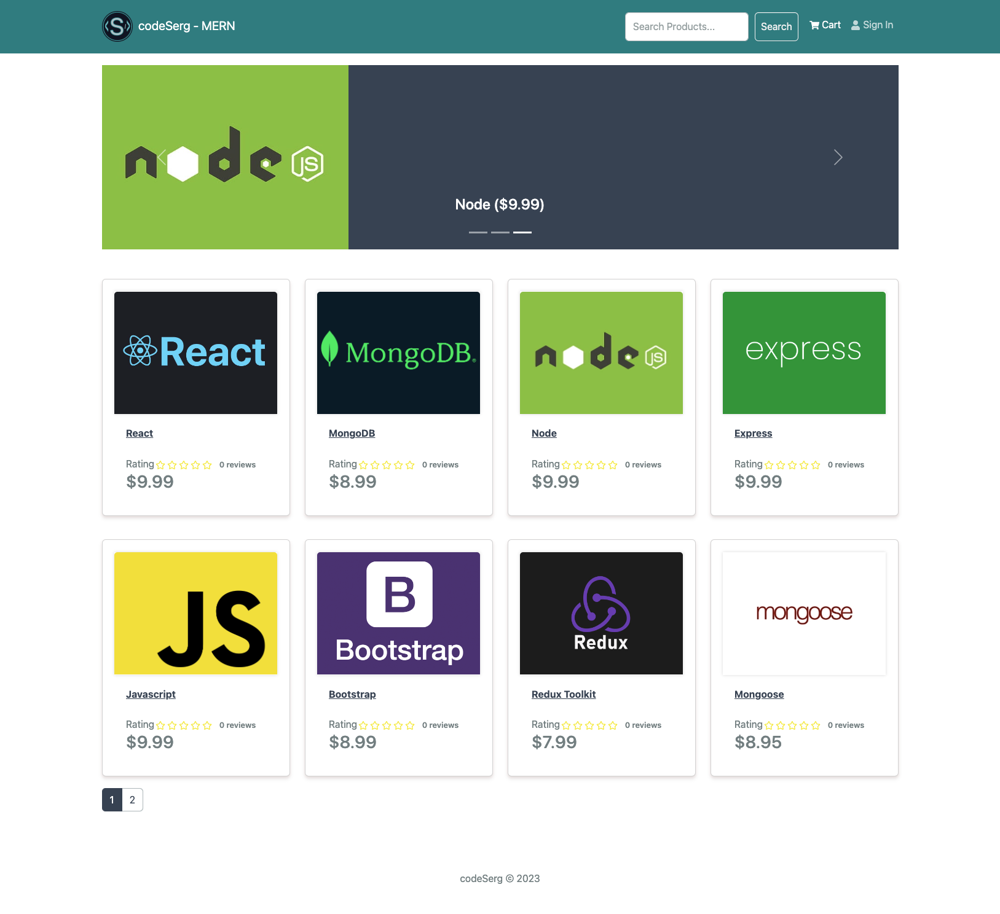

  

    
  

  

    
    
    
      
    
    
    

  

# codeSerg MERN

codeSerg MERN is a web commerce platform built with the MERN stack.  
It offers a modern shopping experience, integrating features like product search, a carousel showcasing top-rated products, user reviews, and an admin panel for user and product management.

   

## Features

- **Product Search**: Enables users to swiftly locate desired products.
- **Top-rated Products Carousel**: Highlights the highest-rated products right on the home page.
- **User Reviews and Ratings**: Provides a platform for users to share feedback and rate products.
- **Pagination**: Ensures a smooth browsing experience by presenting products in a paginated format.
- **PayPay Integration**: Enables PayPal payments.
- **Admin Panel**: Comprehensive tool for managing users and products.

## Tech Stack

- **Backend**: Node.js, Express.js, and MongoDB (with Mongoose).
- **Frontend**: React.js (utilizing Redux Toolkit and React-Router).
- **Authentication**: JWT - JSON Web Tokens.
- **Password Security**: bCrypt.
- **Styling**: Bootstrap.

## Installation

1. Clone the repository:  
   `git clone https://github.com/code-serg/ecommerce-01`

2. Install dependencies:  
   `npm install`  
   `cd frontend`  
   `npm install`

3. Ensure you have the following prerequisites

   - Connectivity to a MongoDB database.
   - PayPal credentials for transaction processing.

4. Set up your `.env` file with necessary environment variables (use `.example.env` as template and adjust as needed):

   - MongoDB URI.
   - JWT secret.
   - PayPal client ID and secret.

5. Run the application:
   `npm start`

## Usage

- **Regular Users**:

  - Register or log in.
  - Browse or search for products.
  - View detailed product descriptions, reviews, and ratings.
  - ... (and other steps for user usage).

- **Admin**:
  - Access the admin dashboard.
  - User management: View, modify, or remove users.
  - Product management: Add, update, or delete products.

## Issues

Encounter a bug or have a feature recommendation? [Open an issue](https://github.com/code-serg/ecommerce-01/issues) to let us know.

## Improvements

- Implement catch-all URL redirect.
- Product Review: Disable Submit button if comment field is empty.
- Style dropdown menu for product ratings.
- Admin panel: Replace browser alert windows with Bootstrap-themed UI.
- Round corners of images.

## Credits

Thanks to Traversy Media for the in depth ecommerce course with detailed lessons.

## License

This project operates under the MIT License.
